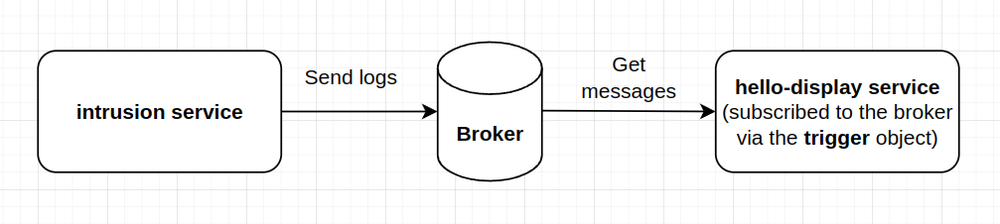

# How-to Guide

## Install kustomize
[Kustomize](https://kubectl.docs.kubernetes.io/) is another tool to install applications on k8s beside Helm. Let's install it first.

```shell
curl -s "https://raw.githubusercontent.com/kubernetes-sigs/kustomize/master/hack/install_kustomize.sh" | bash
sudo mv kustomize /usr/local/bin/
```

## Install Kubeflow
Clone the manifests repository. I did this step already for you so you don't have to redo this. I just want to show you what I did.
```shell
RELEASE=v1.7.0-rc.1
git clone -b $RELEASE --depth 1 --single-branch https://github.com/kubeflow/manifests.git
cd manifests
while ! kustomize build example | kubectl apply -f -; do echo "Retrying to apply resources"; sleep 10; done
```

## Install KServe
KServe was already included in Kubeflow so we don't need to do it again, but make sure to run the following command before moving to the next section:

```shell
kubectl patch cm config-domain --patch '{"data":{"example.com":""}}' -n knative-serving
```

## Quick start

Create a new namespace containing kserve services
```shell
kubectl create ns kserve-test
```

Deploy your first iris model using the following commands
```shell
kubectl apply -f deployments/quickstart.yaml
```

Port-forward to access the service locally via istio ingress
```shell
kubectl port-forward svc/istio-ingressgateway 8000:80 -n istio-system
```

Test our newly created service by using Python client

```shell
python utils/quickstart/client.py
```

OR `cURL` as below (remember to replace `authservice_session` with your own session)
```shell
curl -v -H "Host: sklearn-iris.kserve-test.example.com" -H "Cookie: authservice_session=MTcxNDQ3Mjg3MHxOd3dBTkVKWE5VSXlTMUZUTlRKRlJFUkhWVWRNVVU1UldsUktXRkpXTjB3eVIxZElOVFpWVVVSSFFqWkZUa3MzUTBKWVNUZExVMEU9fAQuK4Wp7NIB2Ye5kTV54cjSDY8X_4yfaO3I1qzInblV" http://localhost:8000/v1/models/sklearn-iris:predict -d @./iris-input.json
```

## Install pack CLI
[Pack](https://buildpacks.io/docs/tools/pack/) is a tool maintained by the Cloud Native Buildpacks project helps to build images by analyzing the source code.

```shell
sudo add-apt-repository ppa:cncf-buildpacks/pack-cli
sudo apt-get update
sudo apt-get install pack-cli
```
To build an image using `pack`, simple run the following command, then push it as usual.

Pack will read `Procfile` along with the python version mentioned in the `runtime.txt` and `requirements.txt` to build your image. For more information, please refer to the following documentation: https://github.com/heroku/cnb-builder-images?tab=readme-ov-file#usage

```shell
pack build --builder heroku/builder:22 quandvrobusto/kserve-intrusion-detection:0.0.1
docker push quandvrobusto/kserve-intrusion-detection:0.0.1
```
Deploy our `instrusion-detection` InferenceService
```shell
kubectl apply -f deployments/intrusion_detection.yaml
```
, and smoke test as follows
```shell
python utils/anomaly/anomaly_client.py
```

Wait for a few seconds, a pod `intrusion-detection-predictor-default-*` will be started and process your request.

## Install KNative Eventing for outlier detection

Install Knative Eventing version 0.16.4 as follows. This is referenced from [this tutorial](https://opensource.com/article/21/2/knative-eventing)

```shell
kubectl apply -f https://github.com/knative/eventing/releases/download/v0.16.4/eventing-crds.yaml
kubectl apply -f https://github.com/knative/eventing/releases/download/v0.16.4/eventing-core.yaml
```

Next, install In-Memory Channel and its corresponding broker to store and route messages.There are some types of channels as listed [here](https://knative.dev/docs/eventing/channels/channels-crds/) and brokers [here](https://knative.dev/docs/eventing/brokers/broker-types/channel-based-broker/) 
```shell
kubectl apply -f https://github.com/knative/eventing/releases/download/v0.16.4/in-memory-channel.yaml
kubectl apply -f other-services/knative/mt-channel-broker.yaml
```

After installing all the above manifests, it's time test our system.
```shell
# Create a new namespace
kubectl create ns eventing-test
# Create a new broker of type MTChannelBasedBroker
kubectl apply -f other-services/knative/broker.yaml
# Create a service logging to the broker
kubectl apply -f other-services/knative/logging.yaml
# Create a service hello-display to display messages from the service logging, please complete the lab in the seldon exercise first before moving on
kubectl apply -f other-services/knative/event-display.yaml
# Create a trigger to subscribe the service hello-display to the broker
kubectl apply -f other-services/knative/trigger.yaml
```

Now, try to make some predictions to the `seldon-model-logging` endpoint with the payload `{"data": {"ndarray": [[1,2,3,4,5,6,7,8,9,10,11,12,13,14,15,15,17,18]]}}`, you should see the logs output by the service `logging` from the service `event-display`. You can replace your service `event-display` by a `outlier-detection` service instead of simply logging .



# Fix some bugs
https://github.com/kserve/kserve/issues/2757